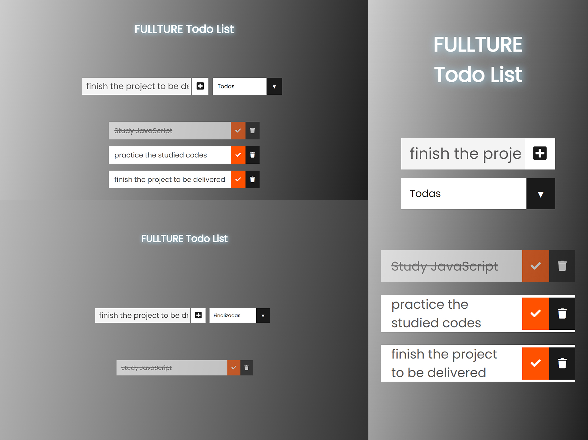

# Welcome! 👋

This is a solution to the challenge [To do list | fullture]().
In this challenge, a to-do list will be made with data persistence and filter of what has already been completed (check) or not.

---
## Table of contents

- [Overview](#overview)
    - [The challenge](#the-challenge)
    - [Screenshot](#screenshot)
    - [Links](#links)
- [My process](#my-process)
    - [Built with](#built-with)
    - [What I learned](#what-i-learned)
    - [Continued development](#continued-development)
- [Author](#author)

## Overview

### The challenge

Users should be able to:

- put the desired tasks as a list.
- check or uncheck what has already been done.
- delete the desired tasks.
- have your list with data persistence even when leaving the screen.

### Screenshot



### Links

- [live site URL](https://marcofranca.github.io/todo-list-challenge/)

## My process

### Built with

- Semantic HTML5 markup
- CSS custom properties
- Flexbox
- desktop-first
- JavaScript


### What I learned

_**through this project I was able to learn how to interact with the `DOM` through `JavaScript`, how to use `localStorage` 
and how to use `JSON`:**_

- I learned to use `document` with the `.querySelector` function to capture the content of a `tag`,
inserting the `tag` itself, the `class` or the `id`.

```javascript
form = document.querySelector('#form1');
```

- I learned that it is possible to use `form` instead of `document` for faster processing.

```javascript
 let item = form.querySelector('.todo-input');
```

- I learned that it is possible to use `event.preventDefault()` to remove predefined events,
such as reloading the page after sending the event.

```javascript
event.preventDefault()
```

- I practiced creating `functions`, both to improve my code by reducing the number of repetitions, and to make it more organized.
- Learned the use of `push` to push an object to an `array`.
- learned how to transform an object into `JSON`.
- I learned to put it also in `localStorage` to have the persistence of this file.

```javascript
function criateObject(object) {
  let todo = {
    id: String(list.length),
    item: object.value,
    check:false
  };
  list.push(todo)
  const dataJson = JSON.stringify(list)
  localStorage.setItem('items',dataJson)
}
```

- I learned to create `tags` through `createElement`.
- include `classes` by `classList`.
- add or change tag content by `innerHTML`.

```javascript
function criateli(className, item) {
  let li = document.createElement('li');
  li.classList.add(className);
  li.innerHTML = item;
  return li;}
```

- I learned how to remove an 'item' from an `array` using `splice`.
- remove a `tag` via `removeChild`.

```javascript
function criateButtonTrash(button, id){
  button.id = id;
  button.addEventListener('click',(b)=>{
    let button = b.target;
    let id = button.id
    for (const idKey in list) {
      if (id === list[idKey].id){
        list.splice(Number(idKey),1);
        localStorage.setItem('items',JSON.stringify(list));
      }}
    let liRemove = document.querySelector('#div'+id);
    ul.removeChild(liRemove);
  })};
  ```
-I learned to use `filter` to filter an `array` without modifying the original.

```javascript
let listTrue = list.filter(filterCheck);

function filterCheck (value){
  if (value.check === true){
    return value
  }}
  ```

### Continued development
I will dedicate myself to future projects using javascript concepts along with html and css which I am studying and
improving myself

## Author

- Linkdin - [Marco Tullio Franca](https://www.linkedin.com/in/marco-franca/)
- Frontend Mentor - [@MarcoFranca](https://www.frontendmentor.io/profile/MarcoFranca)

## Acknowledgments

